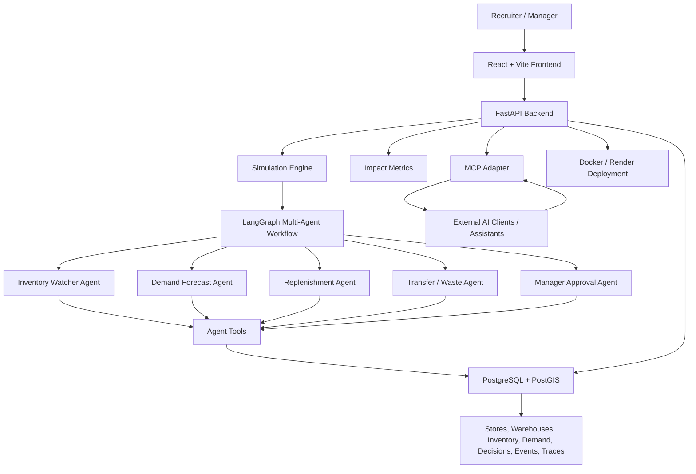

# StockFlow: Multi-Agent Franchise Supply Chain Simulator

StockFlow is an AI-agent-first supply chain simulator for franchise restaurant networks. It shows how multiple specialized agents can watch inventory, forecast demand, reduce food waste, recommend transfers between nearby stores, and create auditable decisions for a human manager to approve.

The project is built as a resume-ready AI systems project, not a normal CRUD inventory dashboard. The frontend exists to make the agent reasoning understandable through a live geo/3D-style operations screen.

## Problem Statement

Franchise restaurants have a difficult inventory problem:

- If a store orders too little, customers face stockouts and the business loses sales.
- If a store orders too much, perishable food expires and profit is lost through waste.
- Demand changes by location, weekday, local events, weather, promotions, and delivery delays.
- Nearby stores may have opposite problems at the same time: one store is short, another store is overstocked.
- Managers need recommendations they can trust, but they also need an audit trail explaining why each action was proposed.

StockFlow solves this by using a multi-agent decision engine that continuously evaluates store inventory, simulated demand, expiry risk, transfer opportunities, and replenishment needs.

## What We Built

StockFlow includes:

- A LangGraph-based multi-agent decision workflow.
- Specialized agents for inventory watching, demand forecasting, replenishment, transfer/waste prevention, and manager approval.
- Tool-calling agents that read supply chain state, create decisions, and record reasoning traces.
- Deterministic simulation logic so the demo works without paid API keys.
- Optional LLM explanations when an API key is available.
- FastAPI endpoints for demo state, simulation ticks, decisions, metrics, agent events, and MCP integration.
- PostgreSQL/PostGIS-backed durable state for inventory, stores, decisions, events, approvals, and geospatial transfer logic.
- A React + Vite + TypeScript frontend for the live operations view.
- A recruiter-friendly map view showing stores, warehouses, risk signals, agent timeline, decision cards, and impact metrics.
- A Model Context Protocol server so external AI assistants can inspect and operate the simulator through tools/resources/prompts.
- Docker and Render deployment support.

## Why Multi-Agent

This project does not use one large agent to do everything. It separates responsibilities into smaller agents because that is easier to test, explain, debug, and trust.

The agents are:

| Agent | Responsibility |
| --- | --- |
| Inventory Watcher Agent | Checks current stock, low inventory, stockout risk, and expiry pressure. |
| Demand Forecast Agent | Estimates upcoming demand using scenario, store, item, and demand history signals. |
| Replenishment Agent | Proposes supplier orders when projected stock is below the target level. |
| Transfer/Waste Agent | Finds nearby stores that can transfer excess stock before it expires. |
| Manager Approval Agent | Converts agent recommendations into human-reviewable approve/reject decisions. |

Each agent produces a plain-English explanation and an auditable trace of what it checked.

## Architecture



## How It Works Step by Step

1. The frontend requests the current supply chain state from the backend.
2. The simulator creates synthetic restaurant demand for each tick.
3. Inventory is reduced as customer demand is fulfilled.
4. The Inventory Watcher Agent checks which stores are at risk.
5. The Demand Forecast Agent estimates near-future demand.
6. The Replenishment Agent decides whether a supplier order is needed.
7. The Transfer/Waste Agent checks whether nearby stores can transfer stock before placing a new order.
8. The Manager Approval Agent creates a pending decision for the human manager.
9. The UI displays the recommendation, reasoning trace, risk level, and business impact.
10. The user approves or rejects the decision.
11. Approved actions update inventory and metrics through idempotent mutation tools.
12. The metrics compare agent-assisted decisions against a baseline.

## Main User Experience

The main screen is designed to quickly explain the project to a recruiter:

- Store nodes show inventory health and risk.
- Warehouse hubs show supply sources.
- Agent cards show which agent is responsible for each part of the workflow.
- The timeline shows what the agents did during each simulation tick.
- Tool traces show what data the agents used.
- Decision cards show recommended orders or transfers with approve/reject controls.
- Metrics show the value of the agent system compared with a baseline.

## Key API Endpoints

| Endpoint | Purpose |
| --- | --- |
| `GET /` | Serves the frontend. |
| `GET /health` | Checks API and database health. |
| `GET /demo/state` | Returns current simulator state for the frontend. |
| `POST /demo/tick` | Runs one simulation tick. |
| `POST /demo/reset` | Resets the demo state. |
| `POST /demo/autoplay/start` | Starts automatic simulation ticks. |
| `POST /demo/autoplay/stop` | Stops automatic simulation ticks. |
| `POST /demo/scenario/{scenario_name}` | Applies a scenario such as rush, delay, expiry, or transfer pressure. |
| `GET /agents/events` | Returns agent event timeline data. |
| `GET /agents/decisions/pending` | Returns pending human decisions. |
| `POST /agents/decisions/{id}/approve` | Approves an agent recommendation. |
| `POST /agents/decisions/{id}/reject` | Rejects an agent recommendation. |
| `GET /metrics/demo-impact` | Shows baseline-vs-agent impact metrics. |
| `POST /mcp` | HTTP JSON-RPC entry point for MCP clients. |

## MCP Integration

StockFlow also exposes a Model Context Protocol adapter. This makes the project useful beyond the built-in frontend.

With MCP, an external AI assistant can:

- Inspect live supply chain state.
- Read agent events and reasoning traces.
- Run a simulation tick.
- View pending decisions.
- Approve or reject recommendations.
- Compare agent performance against the baseline.
- Use reusable prompts to explain franchise risk or summarize agent behavior.

This demonstrates interoperability: the agent system is not locked inside one UI.

## Tech Stack

| Area | Technology | Why It Is Used |
| --- | --- | --- |
| Backend API | FastAPI | Fast Python API layer with clear endpoint structure. |
| Agent Orchestration | LangGraph | Coordinates multi-step, multi-agent decision flow. |
| Agent Tooling | LangChain-style tools | Gives agents structured actions instead of free-form text only. |
| Data Layer | PostgreSQL + PostGIS | Stores durable state and supports geospatial transfer decisions. |
| ORM / DB Access | SQLAlchemy | Python database access and transaction handling. |
| Frontend | React + Vite + TypeScript | Modern frontend stack for a fast interactive dashboard. |
| API State | TanStack Query | Handles frontend server-state fetching and refresh behavior. |
| UI State | Zustand | Keeps simulator UI state simple and lightweight. |
| Map / Geo UI | Leaflet | Displays stores, warehouses, and risk signals on a live map. |
| Interoperability | MCP | Lets external AI clients call StockFlow tools and read context. |
| Deployment | Docker + Render | Reproducible container deployment with a public live URL. |
| Testing | Pytest, TypeScript build, Vite build | Verifies backend logic, MCP behavior, and frontend production build. |

## Running Locally

### 1. Start the database

```bash
docker compose up -d db
```

### 2. Install backend dependencies

```bash
python -m venv venv
source venv/bin/activate
pip install -r requirements.txt
```

### 3. Seed data

```bash
python -m data.seed
```

### 4. Install frontend dependencies

```bash
npm install --prefix frontend
```

### 5. Build frontend

```bash
npm run build --prefix frontend
```

### 6. Run the API

```bash
python -m api.run
```

Open:

```text
http://127.0.0.1:8000
```

## Running with Docker

```bash
docker compose up --build
```

Then open:

```text
http://127.0.0.1:8000
```

## Environment Variables

| Variable | Required | Purpose |
| --- | --- | --- |
| `DATABASE_URL` | Yes | PostgreSQL/PostGIS connection string. |
| `DEMO_MODE` | No | Enables demo-friendly behavior. |
| `SIMULATION_SPEED_MS` | No | Controls autoplay tick speed. |
| `LIVE_SIGNALS_ENABLED` | No | Enables optional live signal enrichment. |
| `LIVE_SIGNAL_CACHE_SECONDS` | No | Controls live signal cache duration. |
| `LIVE_API_TIMEOUT_SECONDS` | No | Timeout for live signal APIs. |
| `ANTHROPIC_API_KEY` or other LLM key | No | Optional. Used only for richer natural-language explanations if configured. |

The core simulator and agents are designed to work without an LLM API key.

## Testing

Run backend and MCP tests:

```bash
venv/bin/python -m pytest
```

Build the frontend:

```bash
npm run build --prefix frontend
```

Recommended full check before pushing:

```bash
npm run build --prefix frontend
venv/bin/python -m pytest
git diff --check
```

## Resume Summary

Strong resume version:

- Built StockFlow, a LangGraph-based multi-agent supply chain simulator where specialized agents forecast demand, detect stockout and expiry risk, recommend replenishment or store-to-store transfers, and produce auditable human-approval decisions.
- Added an MCP integration that exposes StockFlow tools and context to external AI assistants, allowing other clients to inspect live supply chain state, run simulations, review reasoning traces, and approve or reject agent recommendations.

## Project Status

StockFlow currently has a complete end-to-end portfolio slice:

- Multi-agent workflow
- Simulation engine
- Human approval loop
- Durable decision/event state
- MCP adapter
- React operations dashboard
- Docker/Render deployment path
- Automated backend/MCP tests
- Production frontend build

Future improvements could include real POS integrations, richer forecasting models, role-based access control, alert notifications, and more advanced route optimization.
